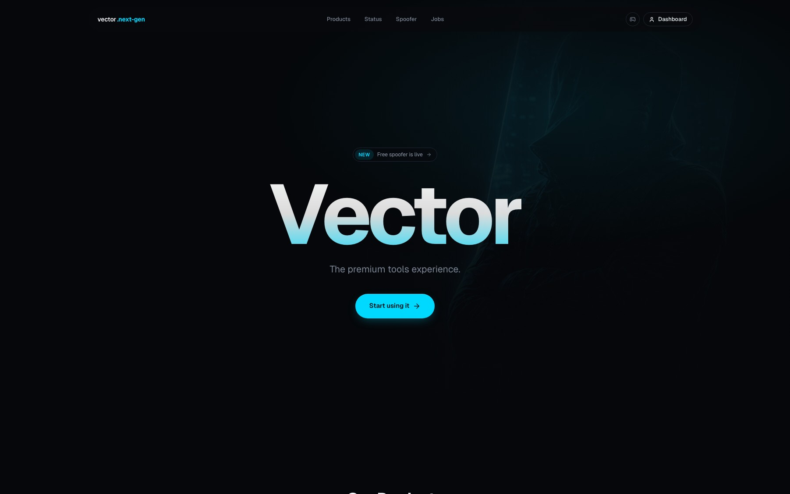
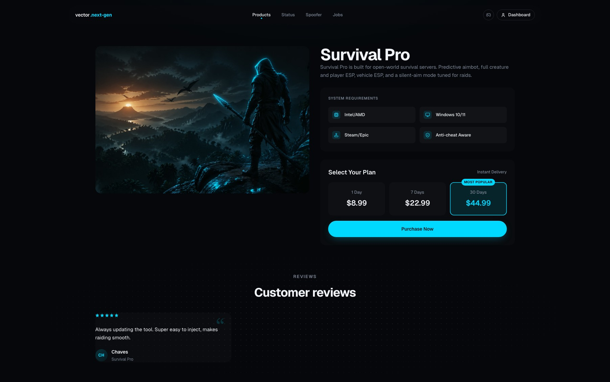

# Shoppex SaaS-Tool Storefront Template

A forkable, production-ready Next.js 16 storefront for selling **subscription-based digital tools** — license-based software, automation tools, Discord-bot SaaS, cheats. Powered by [Shoppex](https://shoppex.io) for catalog, payments, and license delivery.

> **Designed for AI-first customization.** Fork this repo, point Claude / Codex / Cursor at [`CLAUDE.md`](CLAUDE.md), and rebrand in an evening.



## What's in the box

- Floating pill nav with scroll-aware shrink animation
- Full-bleed hero with background art, gradient headline, "Most Popular" CTA
- Drag-to-scroll products carousel with hover-sharpen image effect
- Product detail page with video slot, system requirements, **3-card subscription selector**, and an inline modal checkout
- Per-product customer reviews carousel + "What you get" feature list with sub-feature counts
- Per-product FAQ accordion
- Real-time-style product status page with uptime bars
- Free-tool / spoofer landing page
- Careers page
- 4-column footer with brand block, product/company links, legal row



## Quick start

```bash
bun install
bun run dev
```

The dev server runs on [http://localhost:3013](http://localhost:3013).

By default the storefront ships in **demo mode** with sample tools and a stub checkout, so you can rebrand before connecting it to a live shop.

To go live, edit `.env.local`:

```
NEXT_PUBLIC_SHOPPEX_SHOP_SLUG=your-shop
NEXT_PUBLIC_SHOPPEX_USE_SAMPLE_DATA=false
```

See [`docs/recipes/connect-shoppex-checkout.md`](docs/recipes/connect-shoppex-checkout.md) for the full live-mode walkthrough.

## Customizing

Two files cover ~80% of customizations:

1. [`theme.config.ts`](theme.config.ts) — brand identity, colors, hero copy, footer columns
2. [`src/config/storefront.config.ts`](src/config/storefront.config.ts) — products, plans, status reports, reviews, features, jobs, FAQ

For step-by-step guides see [`docs/recipes/`](docs/recipes/). For LLM-friendly prompts see [`docs/prompts/`](docs/prompts/).

## AI-assisted customization

Open [`CLAUDE.md`](CLAUDE.md) — it's the operating manual for Claude / Codex / Cursor. Then pick a prompt template from [`docs/prompts/`](docs/prompts/), fill in your details, and paste it into your AI agent. The recipes are linked from the prompts.

## Going live with Shoppex

1. Set `NEXT_PUBLIC_SHOPPEX_SHOP_SLUG` and `NEXT_PUBLIC_SHOPPEX_USE_SAMPLE_DATA=false`
2. Map each plan in `src/config/storefront.config.ts` to a real Shoppex `productId` + `variantId`
3. Done — the checkout modal already calls `@shoppexio/storefront` and redirects to hosted checkout

Full guide: [`docs/recipes/connect-shoppex-checkout.md`](docs/recipes/connect-shoppex-checkout.md). End-to-end test guide: [`docs/recipes/test-live-checkout-e2e.md`](docs/recipes/test-live-checkout-e2e.md).

## Stack

- Next.js 16 (App Router)
- TypeScript
- Tailwind CSS v4 + hand-rolled CSS in `globals.css`
- Radix UI primitives
- Embla carousel
- `@shoppexio/storefront` SDK
- Lucide icons

## Project structure

See [`CLAUDE.md`](CLAUDE.md) → "Architecture map".

## Looking for the generic engine starter?

This template is opinionated for digital subscriptions. If you're building a different vertical (Fashion, Marketplace, Physical Goods), use [`shoppexio/storefront-starter`](https://github.com/shoppexio/storefront-starter) instead — same stack, neutral baseline.

## License

MIT — fork, customize, ship.
